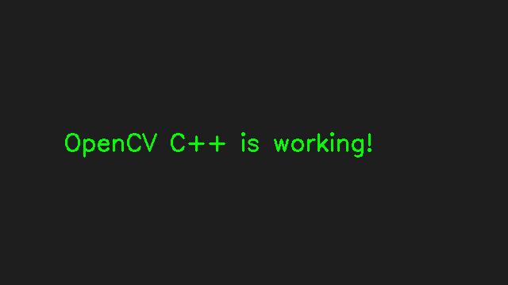

# Blackbox ADAS C++ Project

C++와 OpenCV를 사용하여 블랙박스 영상 기반 ADAS 기능을 구현하는 프로젝트입니다.

## 현재 구현 내용

- Ubuntu WSL 기반 C++ 개발 환경 구성
- CMake 기반 C++17 빌드 시스템 구성
- OpenCV 라이브러리 연동
- OpenCV 이미지 생성 및 파일 저장

## 기술 스택

- C++17
- OpenCV
- CMake
- Ubuntu / WSL

## 프로젝트 구조

- `src/main.cpp`: C++ 소스코드
- `videos/`: 입력 영상 보관
- `results/opencv_test.png`: OpenCV 테스트 결과
- `CMakeLists.txt`: CMake 빌드 설정
- `README.md`: 프로젝트 설명

## 빌드 및 실행

1. `cmake -S . -B build`
2. `cmake --build build`
3. `./build/adas`

## 실행 결과

프로그램을 실행하면 `results/opencv_test.png` 파일이 생성됩니다.

## 향후 구현 계획

- 블랙박스 영상 입력 및 출력
- ROI 기반 영상 분석
- 움직임 감지
- 객체 검출
- 객체 추적
- ADAS 이벤트 판단 로직
- FPS 및 Latency 측정