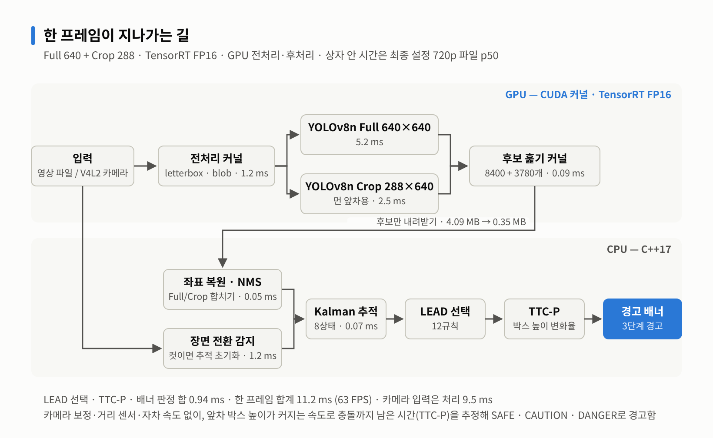
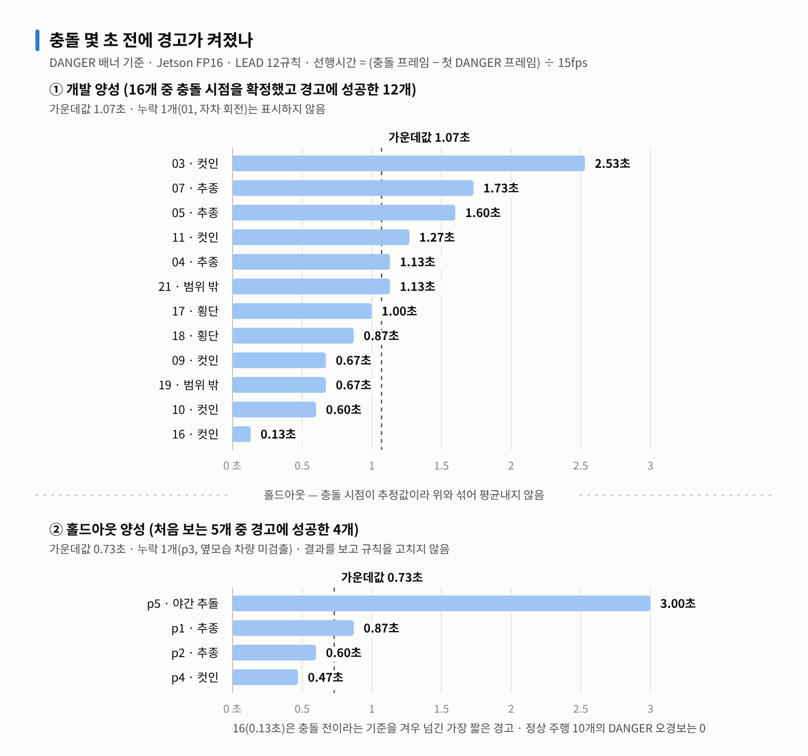
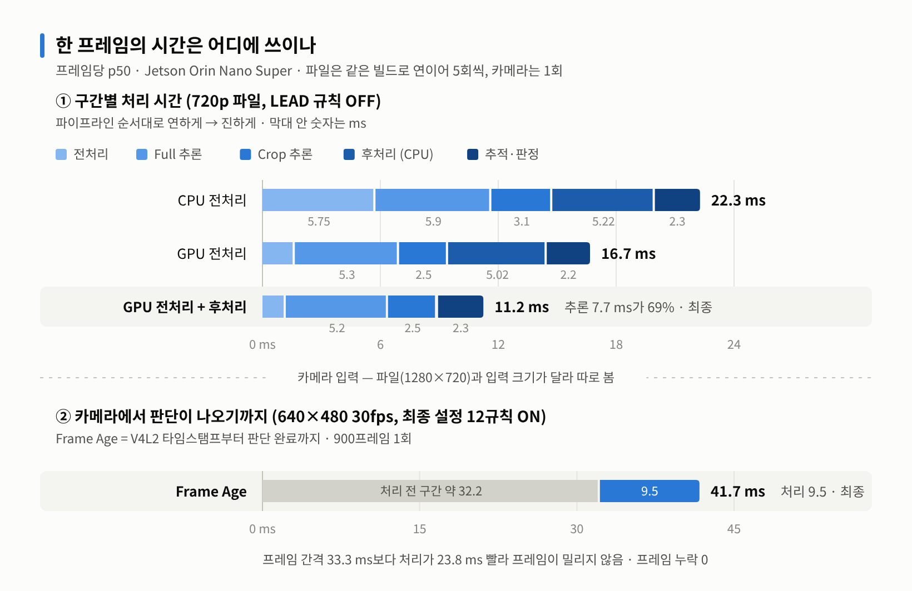
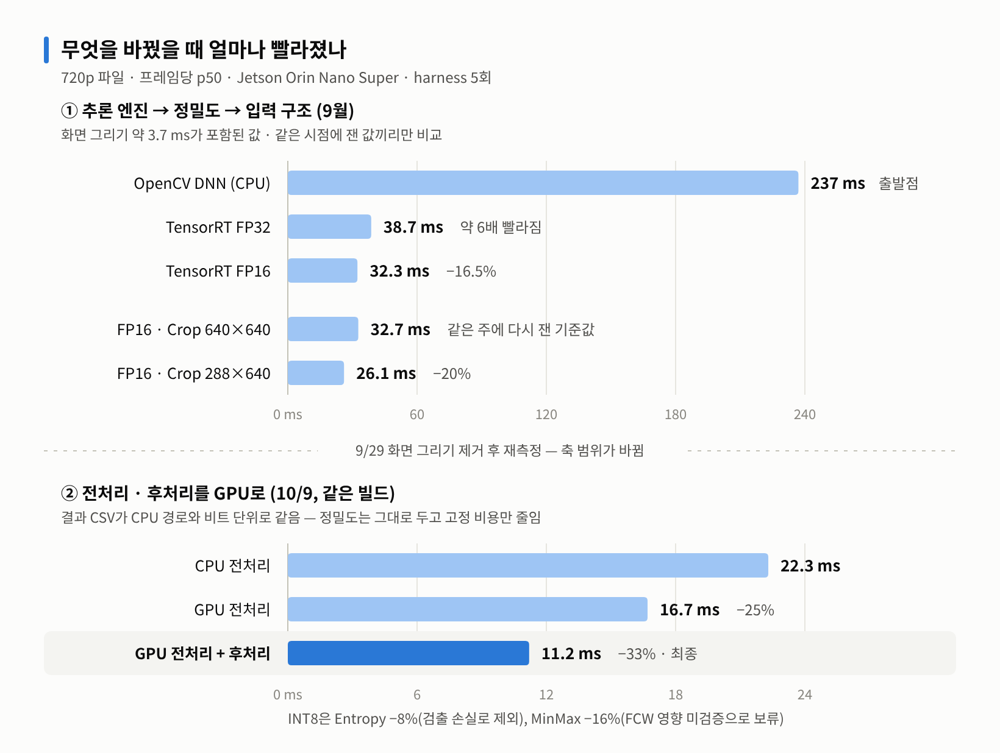

# On-device Perception Core — C++ FCW

단안 블랙박스 영상에서 선행 차량을 검출·추적하고 추돌 위험을 판단하는 C++ 파이프라인이다. Jetson Orin Nano Super에서 TensorRT·CUDA로 최적화하고, 41개 평가 영상으로 경고 기능을 검증했다.

**직접 구현한 범위** — C++17 검출·추적·위험 판단 파이프라인 · V4L2 카메라 캡처 · CUDA 전처리·후처리 커널 · TensorRT 백엔드 · 성능·회귀 검증 도구(측정 harness, 골든 MD5 비교, FCW 채점)

<p align="center">
  
</p>

| 항목 | 결과 |
| --- | --- |
| 처리 성능 | **720p 11.2 ms (63 FPS)** — GPU 전처리·후처리 적용 전 22.3 ms 대비 약 50% 단축 |
| 경고 검증 | **개발 평가 경고 15/16**, 정상 주행 DANGER 오경보 **0/10** |
| 실제 카메라 | **30fps 입력, 처리 9.5 ms, Frame Age 41.7 ms**, 프레임 누락 0 |

<sub>파일: `input.mp4` 720p, LEAD 규칙 OFF, 구성별 5회 가운데값 · 카메라: 640×480 30fps, 최종 12규칙 ON, 900프레임 1회 · 장비: Jetson Orin Nano Super, MAXN_SUPER, 클럭 고정</sub>

---

## 구조

<picture>
  <source media="(prefers-color-scheme: dark)" srcset="docs/assets/readme/architecture_dark.png">
  
</picture>

프레임마다 YOLO를 두 번 돌린다. Full은 화면 전체, Crop은 먼 앞차를 보기 위해 잘라 낸 가운데 영역이다.

---

## Q1. FCW가 제대로 동작하는가?

**개발 평가 16개 중 15개에서 충돌 전에 경고했고, 정상 주행 10개에서는 DANGER 오경보가 없었다. 규칙을 정한 뒤 고른 영상 10개에서는 누락 1·오경보 1이 나왔다.**

| 평가 구분 | 용도 | 결과 |
| --- | --- | --- |
| 개발 양성 16개 | 규칙 개선·회귀검증 | 경고 성공 15, 누락 1 |
| 개발 음성(정상 주행) 10개 | 규칙 개선·회귀검증 | DANGER 오경보 0 |
| 홀드아웃 양성 5개 | 평가만 — 결과로 코드를 고치지 않음 | 경고 성공 4, 누락 1 |
| 홀드아웃 음성 5개 | 평가만 — 결과로 코드를 고치지 않음 | DANGER 오경보 1 |
| 이륜차 5개 | 실행·기록만 — 검출 단계 한계로 집계 제외 | 미해결 |

<picture>
  <source media="(prefers-color-scheme: dark)" srcset="docs/assets/readme/q1_lead_time_dark.png">
  
</picture>

경고 선행시간 가운데값 **1.07초**(최소 0.13초 · 최대 2.53초) — 충돌 시점을 확정했고 경고에 성공한 12개 기준. 홀드아웃 4개는 충돌 시점이 추정값이라 따로 본다(가운데값 0.73초).

<sub>
누락·오경보 원인 — 01: 자차가 회전하면서 대상이 고정 차로 영역 밖으로 나감 · p3_160703: 차선을 가로지르는 옆모습 차량을 YOLO가 13프레임 동안 못 잡음 · 6_004: Crop 경계에서 지붕이 잘린 박스가 온전해지며 높이가 31% 뛰어 TTC 오판.
평가 영상 41개의 구성·장면·채점 기준: <a href="eval/README.md">eval/README.md</a>
</sub>

<details>
<summary>영상별 결과·규칙 변화 과정</summary>

[docs/analysis/q1-fcw-final-result.md](docs/analysis/q1-fcw-final-result.md)

</details>

---

## Q2·Q3. 얼마나 빠른가, 어디가 느린가?

**Q2** — 최종 설정은 720p 한 프레임을 **11.2 ms(63 FPS)** 에 처리한다. 목표 15 FPS(66.7 ms)의 0.17배다.
**Q3** — 지금 시간을 가장 많이 쓰는 곳은 **YOLO 추론(7.7 ms, 69%)** 이다. 전처리·후처리는 GPU로 옮겨 1.2 ms만 남았다.

<picture>
  <source media="(prefers-color-scheme: dark)" srcset="docs/assets/readme/q2q3_breakdown_dark.png">
  
</picture>

카메라 입력에서는 **처리 전 구간 약 32.2 ms + 처리 9.5 ms = Frame Age 41.7 ms**다. Frame Age는 V4L2 타임스탬프부터 판단이 끝날 때까지의 시간이다. 처리가 프레임 간격(33.3 ms)보다 23.8 ms 빨라 프레임이 밀리지 않는다.

<details>
<summary>측정 조건·5회 변동·전력·RAM·카메라 비교</summary>

[docs/analysis/q2-q3-speed-bottleneck.md](docs/analysis/q2-q3-speed-bottleneck.md)

</details>

---

## Q4. 무엇을 바꾸면 빨라지는가?

**추론 엔진(TensorRT)이 가장 컸고, 그다음은 정밀도가 아니라 추론 밖의 고정 비용이었다.**

<picture>
  <source media="(prefers-color-scheme: dark)" srcset="docs/assets/readme/q4_steps_dark.png">
  
</picture>

| 단계 | 변경 | 처리 시간 | 효과 |
| --- | --- | ---: | ---: |
| 추론 엔진·정밀도·구조 (9월) | OpenCV DNN(CPU) → TensorRT FP32 | 237 → 38.7 ms | 약 6배 |
| | FP32 → FP16 | 38.7 → 32.3 ms | −16.5% |
| | Crop 640×640 → 288×640 | 32.7 → 26.1 ms | −20% |
| *9/29 화면 그리기 제거 후 재측정* | | | |
| 같은 빌드 비교 (10/9) | CPU 전처리 → GPU 전처리 | 22.3 → 16.7 ms | −25% |
| | → GPU 후처리 | 16.7 → 11.2 ms | −33% |

INT8은 Entropy가 −8%였지만 검출 손실로 제외했고, MinMax(−16%)는 FCW 영향을 검증하지 못해 보류했다.

<details>
<summary>단계별 측정 조건</summary>

[docs/analysis/q4-structure-precision-speed.md](docs/analysis/q4-structure-precision-speed.md)

</details>

---

## Q5. 빨라진 대신 결과가 달라지는가?

**속도만 보고 고르지 않았다. 바꿀 때마다 FCW 결과가 그대로인지 먼저 확인했다.**

| 변경 | 확인한 결과 | 결정 |
| --- | --- | --- |
| FP32 → FP16 | 21개 영상의 판정·첫 경고 프레임 일치. 박스 수치에는 차이 있음 | 채택 |
| GPU 전처리·후처리 | FP16 CPU 전후처리 경로와 비교. 입력 텐서·후보 목록 비트 일치, 최종 41개 영상 CSV 82/82 일치 | 채택 |
| Crop 288 | 21개 중 20개 첫 경고 동일, 04는 누락 → 경고 | 채택 |
| INT8 Entropy | FP32의 신뢰도 0.4 이상 박스 중 25.2%에 대응 박스 없음 | 제외 |
| INT8 MinMax | 검출 손실은 줄었으나 박스 높이 차이가 남고 FCW 영향 미검증 | 보류 |

<details>
<summary>정밀도별 검출·박스 비교</summary>

[docs/analysis/q5-precision-accuracy.md](docs/analysis/q5-precision-accuracy.md)

</details>

---

## Q6. 제한된 하드웨어에서 무엇을 선택했는가?

| 항목 | 선택 | 이유 |
| --- | --- | --- |
| 추론 구조 | Full 640×640 + Crop 288×640 | 같은 배율에서 회색 여백만 빼 −20% |
| 정밀도 | TensorRT FP16 | FP32와 경고 결과가 같음. INT8은 속도 이득 대비 FCW 영향 미검증 |
| 전처리·후처리 | GPU 커널 (`--gpu-preprocess`, `--gpu-postprocess`, 카메라 `--camera-zero-copy`) | 결과를 안 바꾸면서 22.3 → 11.2 ms |
| 캡처 | 동기 캡처 | 처리가 카메라 간격보다 빨라 스레드 분리가 필요 없음 |
| LEAD·경고 규칙 | 12규칙 | 개발 평가 누락 4 → 1, 정상 주행 오경보 0 유지 |
| 전력 모드 | MAXN_SUPER | Frame Age가 가장 짧음. 15W는 전력 −21%인 저전력 대안 |

<sub>프레임당 에너지(전력 ÷ 실제 FPS) 276 → 180 mJ · RAM은 OS 포함 보드 전체 약 2.2 GB, GPU 경로를 켜도 늘지 않음</sub>

<details>
<summary>Memory Path·Power Mode 비교</summary>

[docs/analysis/q6-embedded-configuration.md](docs/analysis/q6-embedded-configuration.md)

</details>

---

## 실행

**Jetson (TensorRT)**

```bash
cmake -S . -B build -DCMAKE_BUILD_TYPE=Release -DENABLE_TENSORRT=ON
cmake --build build -j$(nproc)

./build/apps/adas videos/input.mp4 \
  --backend tensorrt_fp16 \
  --crop-model models/yolov8n_288x640.onnx --crop-input 288x640 \
  --gpu-preprocess --gpu-postprocess \
  --lead-rule overlap,history,gap,passby,gate,bonnet,hold,rank,bottom,edge,cropedge,rawconfirm
```

카메라는 `--camera /dev/video0 --camera-zero-copy`를 더한다. x86에서는 `-DENABLE_TENSORRT=ON` 없이 빌드하고 `--backend opencv_dnn`으로 돌린다.

필요한 파일: `models/yolov8n.onnx`, `models/yolov8n_288x640.onnx`, 입력 영상. 결과는 `results/<영상>_frames.csv`, `_banner.csv`, `_output.avi`에 생긴다.

<details>
<summary>검증 도구</summary>

| 도구 | 하는 일 |
| --- | --- |
| `scripts/benchmark_harness.sh` | 같은 조건 5회 측정, 클럭·온도·전력 기록, 골든 MD5 비교 |
| `scripts/run_eval_set.sh` | 평가 영상 목록을 영상별 차로 영역으로 실행 |
| `tools/evaluate_fcw.py` | 경고 누락·오경보·선행시간 채점 |
| `tools/analyze_runs.py` | 구간별 처리 시간·Frame Age·변동 요약 |

골든 MD5 기준은 [docs/analysis/README.md](docs/analysis/README.md), 평가셋 구성은 [eval/README.md](eval/README.md)에 있다.

</details>

---

## 한계와 다음 단계

- 차로 영역이 영상마다 고정이라 자차가 크게 회전하면 대상을 놓친다(01).
- TTC-P는 박스 크기 변화로 본 상대 지표이고 실제 거리 기반 TTC가 아니다.
- 이륜차는 검출 단계부터 불안정해 평가에서 분리했다.
- GPU 전처리·후처리는 CUDA 전용이다.
- 다음: **TOPST AI 보드(INT8 NPU) 이식**(11월), **ROS2 Perception Component**(12월).

상세 분석: [docs/analysis/](docs/analysis/) · 평가셋: [eval/](eval/) · 작업일지: [docs/](docs/)
